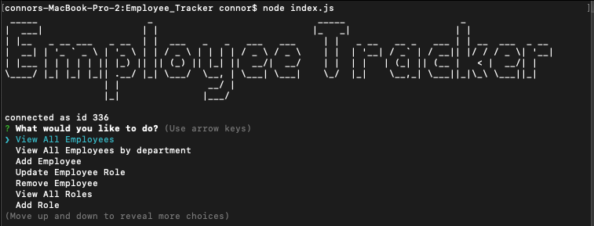

# Employee_Tracker
This is a command line application that is used to manage a companies various employees, departments and roles. It is using Javascript, Node.js, MySql, and the inquirer, mysql, console.table, and ascii - art node modules. The database is stored in mysql and you can interact with it through a variety fo command line prompts. There is the ability to view all employees, roles and departments, add and delete all employees roles and departments, view all employees by department, as well as update employee roles. I also used the dotenv nde package to mask sensitive information. 

Link to video 
